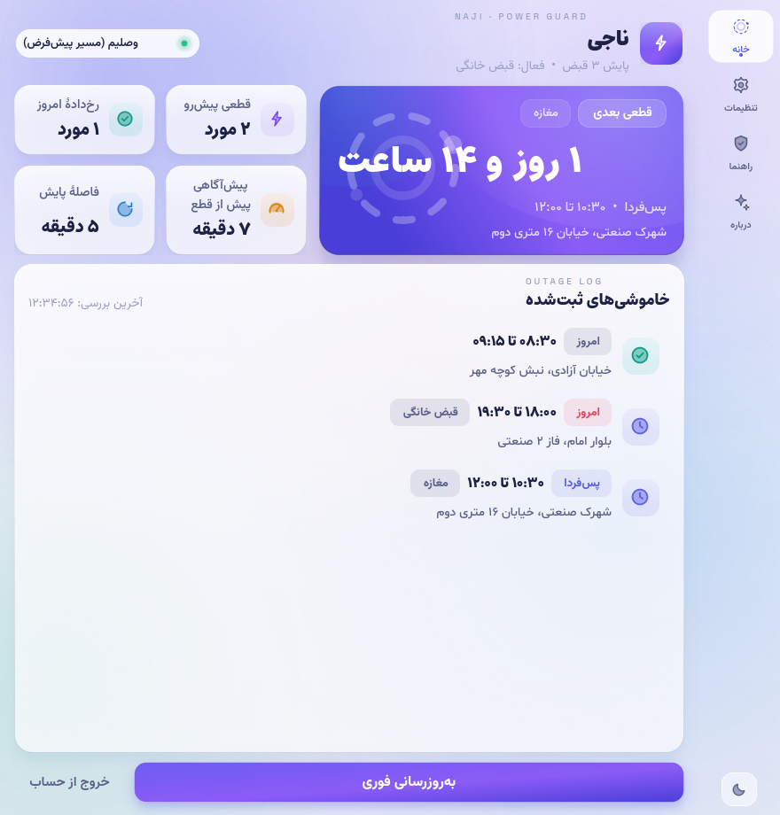
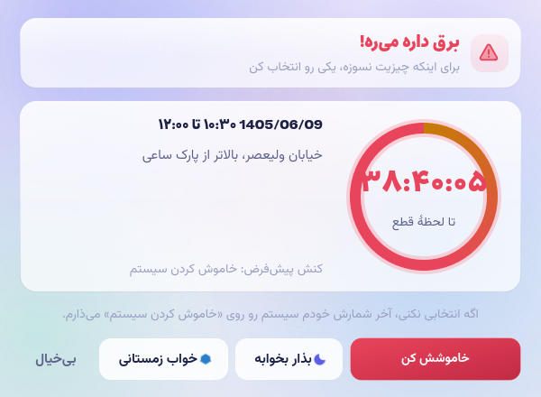

# ⚡ ناجی (Naji)

برنامه‌ی ویندوزی اطلاع‌رسانی خاموشی برق، متصل به سامانه‌ی [برق‌من](https://bargheman.com) — با هشدار خودکار «قبل از قطعی» و امکان اجرای خودکار **خاموش کردن / اسلیپ / هیبرنیت**.

> برنامه مستقیماً و از کامپیوتر خود کاربر به `uiapi.saapa.ir` وصل می‌شود؛
> **هیچ سرور، پروکسی یا واسطی در کار نیست** و توکن شما فقط روی همان سیستم ذخیره می‌شود.

| پنجره‌ی اصلی | پنجره‌ی هشدار |
|---|---|
|  |  |

تم روشن/تیره و زبان فارسی/انگلیسی از تنظیمات یا دکمه‌ی تم پایین نوار کناری عوض می‌شود؛ «هماهنگ با ویندوز» پیش‌فرض است.

## ✨ امکانات (نسخه‌ی ۴)

- 🌐 **دوزبانه**: فارسی و انگلیسی — تعویض از تنظیمات، با RTL/LTR خودکار و ارقام بومی
- 🎨 **هماهنگ با ویندوز**: رنگ اکسنت و تم روشن/تیره‌ی سیستم به‌صورت زنده روی UI می‌افتد
- 🧾 **پایش چند-قبضی**: خونه، مغازه، شرکت… همه در یک لیست، با نشانِ «مال کدومه»
- 🔒 **تک‌نمونه**: کلیک دوباره روی آیکون، پنجره‌ی جدیدی باز نمی‌کند — فقط همان پنجره جلو می‌آید
- 🧭 **چهار صفحه** با نوار کناری: خانه / تنظیمات / راهنما / درباره
- 🆘 **راهنمای «قبض به برق‌من وصل نیست»**: چهار قدم تا راه‌افتادن + دکمه‌ی «بررسی دوباره»
- ورود امن با شماره موبایل + کد تایید (OTP) سامانه برق‌من
- نمایش خاموشی‌های امروز و ۵ روز آینده با برچسب «امروز / فردا / پس‌فردا / …»
- **هشدار خودکار قبل از قطع** (به انتخاب شما: ۱ تا ۱۲۰ دقیقه قبل از شروع هر خاموشی) با پنجره‌ی شمارش معکوس و ۴ کنش:
  خاموشش کن (با ۳۰ ثانیه فرصت لغو از تری) / بذار بخوابه / خواب زمستانی / بی‌خیال
- **تایمر اعلان دستِ شماست** (v۴٫۴٫۴): پنجره/اعلان هشدار فقط به اندازه‌ای که تعیین می‌کنید (۵ تا ۱۲۰ ثانیه، پیش‌فرض ۱۵) باز می‌ماند؛ اگر تا پایانش واکنش ندهید، اقدام پیش‌فرض خودکار اجرا می‌شود
- سه حالت عملکرد: **فقط خبر بده / خبر بده + اقدام / مستقیم اقدام کن**
- اجرای دائم در تری سیستم + اجرای خودکار با ویندوز
- هشدار مستقل از بازه‌ی بررسی: ناجی هر ۲۰ ثانیه زمان خاموشی‌ها را با ساعت سیستم می‌سنجد؛ «چند دقیقه قبل» و «فاصله‌ی پایش» را خودتان تعیین می‌کنید (v۴٫۴٫۳)؛ و آدرس خاموشی از هر شکلی از داده‌ی برق‌من بیرون کشیده می‌شود (v۴٫۴٫۲)
- **خلوص زبان** (v۴٫۴٫۴): در فارسی فقط فارسی، در انگلیسی فقط انگلیسی — میکرولیبل‌های تزئینی و خط‌های «درباره» دیگر دوزبانه نیستند و قلم هر زبان مختص خودش است
- تشخیص دقیق تاریخ شمسی و مسیریابی هوشمند شبکه (کار با فیلترشکن)
- طراحی «ماتِ آرام» (Calm Matte): بومِ ساکنِ مات با یک نورِ تک‌فام + وینیت + گرِین، کارت‌های اِلیویت با تفکیک روشنایی — موشنِ ژله‌ای فقط در کنترل‌ها (قرص ناوبری/سوییچ/دکمه‌ها)، هرگز در پس‌زمینه — چهار خانواده فونت، آیکون‌های SVG دست‌ساز — بدون ایموجی
- صفحه‌های اسکرول‌پذیر با اسکرول‌بار نمایان

### نکته‌های نسخه‌ی ۵٫۱٫۰ — «دوبینسِ راستین» (رفع باگ‌های گزارش‌شده + انیمیشن مرجع)

- **چرا «انیمیشن پیاده نشده» دیده می‌شد**: در پاسِ قبلیِ «ظرافت»، منحنیِ مرجعِ transitions.dev صاف شده بود (y ≤ ۱) و اورشوت به ~۳٫۵٪ رسیده بود؛ نتیجه، یک سرسره‌ی ساده بود — نه دوبینس. حالا **پورت وفادار**: حل‌گرِ عددیِ `cubic-bezier(0.34, 1.35, 0.64, 1)` (اورشوتِ ذاتیِ منحنی برگشت) + keyframes دقیق `۰/۵۵/۸۰/۱۰۰` با `ov1 = ۶٫۸٪ مسیر، ov2 = 0` — عین مرجع. **سوییچ‌ها عیناً با پارامترهای مرجع** حرکت می‌کنند؛ قرصِ ناوبری و قرصِ تب‌ها با `pop=1.22/1.2` (سفرِ بلند) همان شخصیت را با اوجِ مهارشده دارند.
- **همین دوبینس برای دکمه‌ها**: فشار → جمع‌شدن ۰٫۹۶۵؛ رهاشدن → سفرِ دوبینسیِ مقیاس (اورشوت ~۱٫۰۲ → میکرو-فرورفتگی → نشست). حتی کلیکِ خیلی سریع (فشار و رها در یک چرخه) هم ژله می‌گیرد.
- **رفع کرشِ استارتاپ**: اگر `settings.json` روی دیسک `null` بود (نوشته‌ی ناقص/خروجِ ناگهانی)، اپ با `AttributeError` بالا نمی‌آمد. حالا فایلِ غیر-dict نادیده گرفته می‌شود و **ذخیره اتمیک** شد (نوشتن در `.tmp` + `os.replace`) — قطعِ برق وسطِ ذخیره دیگر فایل را خراب نمی‌کند.
- **رفع نشت آبجکت انیمیشن**: هر کلیک/تاگل قبلاً یک QVariantAnimation نو می‌ساخت و قدیمی زنده می‌ماند (۳۰ تاگل = ۶۰ آبجکتِ مرده). حالا `kill_anim()` (stop + deleteLater) در سوییچ/ناوبری/تب‌ها/دکمه‌ها — بعد از ۳۰ تاگل فقط ۲ آبجکت زنده است (قفلِ تست).
- **تعویض صفحه بدون فلاش**: fadeِ `QGraphicsOpacityEffect` حذف شد (در باک‌اند GPU ویندوز فلاش/مورب می‌شد و هر سفر دو رندرِ کاملِ صفحه می‌کرد)؛ موشنِ سفر بر عهده‌ی قرصِ دوبینسِ ریل است (الگوی Fluent).
- **کم‌مصرف‌سازی حلقه‌های تزئینی**: شیمرِ هیرو و تپشِ پییل از درایور ۶۰fps به **۲۴fps** رفتند و **وقتی صفحه/پنجره پنهان است کامل متوقف می‌شوند** — باتری و CPU لپ‌تاپ.
- **سربرگ هرگز سرریز نمی‌کند**: بریدنِ متنِ قبض‌ها به عرضِ واقعیِ لیبل داینامیک شد (قبلاً ۳۶۰px ثابت بود) + سقف ۲۶۰px برای چیپ موقعیت.
- تست جدید `test_v510.py` (۳۴ قفل — از جمله **نمونه‌گیریِ زنده از اورشوت** در سوییچ/ناوبری/تب‌ها/دکمه‌ها و سنجش نشت) + رندرهای `download/ui_v510/` شامل **نوارِ فریم‌های دوبینس** (مدرک بصریِ حرکت).

### نکته‌های نسخه‌ی ۵٫۰٫۰ — «بنفشِ نیمه‌شب» (بازطراحی پریمیوم 2.5D)

- **پالت امضای جدید دقیقاً مطابق بریفت پریمیوم**: بومِ تیره `#0D0F14 → #090B0F` (سرمه‌ایِ عمیق با ته‌مایه‌ی آبی)، اکسنت بنفشِ `#7B5CFF` با هاور `#8F75FF` و فشار `#6A4BE0`، سبزِ نرمِ `#34D399` برای «وصلیم»، و هاله‌ی بنفشِ `123,92,255` زیر دکمه‌ی اصلی. تم روشن صدفی ماند ولی اکسنتش به بنفشِ خوانای `#6D50F0` هم‌خانواده تغییر کرد.
- **بازترسیم کامل آیکون‌ها به سبک Lucide** (لایسنس ISC): هندسه‌ی واقعی Lucide روی شبکه‌ی ۲۴×۲۴ برای هر ۲۸ گلیف — از صاعقه و چرخ‌دنده تا خانه، کاربران و پین نقشه. وزنِ خط در «همه‌ی» گلیف‌ها دقیقاً `۱٫۷۵px` با سرِ گرد و اتصالِ گرد؛ لایه‌ی «پرش نرم» (لکه‌ی هاله‌ای پشت آیکون‌ها) که حسِ ارزان می‌داد کلاً حذف شد. آیکون‌های تازه: `mappin` برای چیپ موقعیت.
- **حس 2.5D در کل برنامه**: کارت‌ها گرادیانِ اِلیویشن گرفتند (بالای کارت روشن‌تر از کف — قاعده‌ی «سطحِ بالاتر = روشن‌تر» متریال) + لبه‌ی ضخامت در کف (سایه‌ی داخلیِ ظریف — کارت مثل اسلبِ سرِپا) + سایه‌های نرمِ بزرگ‌تر (هیرو blur=۴۸/alpha=۸۰). قرصِ ناوبری فعال هاله‌ی بنفشِ نرم گرفت (بریف: active state with soft glow) و دکمه‌ی «به‌روزرسانی فوری» هاله‌ی بنفشِ محو (soft purple glow).
- **شیشه‌ی اکریلیک واقعی**: سطوح تیره `rgba(26,29,41,0.72)` شدند تا بوم از پشتِ کارت کمی بگذرد (بریف: acrylic/glassmorphism) — با حفظِ خوانایی (Δ=۲۰ لایت‌نس تفکیک کارت/بوم در رندر واقعی) و هِیرلاین مرزی.
- **چیدمان داشبورد مطابق بریفت**: کارت هیروی «قطعی بعدی» بلندتر (۲۳۶px) با شمارشِ معکوسِ درشت‌تر (سقف قلم ۴۴px)، چهار کارت آماری ۲×۲ کنارش، کارت «خاموشی‌های ثبت‌شده»، و **نوار پایینِ تازه**: خلاصه‌ی «۳ مورد در راهه · ۱ مورد امروز · پایش ۲ قبض» در سمتِ شروع + دکمه‌ی درشتِ ۵۲px در انتهای ردیف. چیپ موقعیتِ سربرگ (پین + آدرسِ واقعیِ نزدیک‌ترین خاموشیِ آینده) کاملاً داده‌محور است و بدون داده پنهان می‌شود. پنجره‌ی پیش‌فرض پهن‌تر شد (۹۸۰px).
- تست جدید `test_v500.py` (۳۶ قفل) + رندرهای `download/ui_v500/` (۱۷ صحنه در دو تم + EN + اکسنت ویندوز + پنجره‌ی باریک).

### نکته‌های نسخه‌ی ۴٫۸٫۰

- **حذف کامل بکگراند انیمیشنی RGB**: بومِ شش‌لکه‌ی شفقِ متحرک (بازیِ فام‌های ایندیگو/بنفش/فیروزه/گلبهی) کلاً برچیده شد — همان چیزی که حسِ «چیپ» می‌داد. جایگزین، الگوی مرجع مایکروسافت برای اپ دسکتاپ است: لایه‌ی پایه‌ی **ساکنِ اوپک** (گرادیان مات) + **یک** نورِ تک‌فام در بالای بوم + وینیتِ نرم + گرِین. هیچ تایمری در پس‌زمینه نیست؛ paintEvent فقط یک بلیتِ کش‌شده است.
- **پایانِ «فیدشدن بخش‌ها» در هر دو تم**: طبق اصول اِلیویشن تم تیره (Material/Atlassian)، تفکیک با روشنایی می‌آید نه رنگ اشباع — در تیره کارت‌ها خنثیِ روشن‌تر و تقریباً اوپک شدند (`rgba(30,30,37,0.96)` روی بوم `#0a0a0e`، Δ≈۲۷ لایت‌نس) و در روشن بوم صدفی عمیق‌تر (`#f3eee6→#e9e1d4`) و کارت‌ها سفیدِ کاغذی (`rgba(255,255,255,0.88)`، Δ≈۳۱). هِیرلاینِ مرزی هم واضح‌تر شد.
- **تینتِ مایکا با اکسنت ویندوز**: در تم تیره نورِ بالای بوم فامِ اکسنتِ سیستم را با آلفای ≤۲۰ می‌گیرد؛ در تم روشن نورِ استودیویی خنثی می‌ماند تا اکسنت‌های اشباع (زرد ویندوز) روی بوم لکه نزنند.

### نکته‌های نسخه‌ی ۴٫۷٫۰

- **سفید صدفیِ مات (تم روشن)**: بومِ شیریِ گرم `#f8f5f0 → #eeeae3` با ته‌مایه‌ی صدف؛ متنِ گرمِ زغالی به‌جای سرمه‌ای؛ لبه‌ها و سایه‌ها گرم؛ براق‌ها کف‌کرده شدند (sheen ۰٫۵۵ → ۰٫۲۸) و لکه‌ی شامپاینیِ گرم میان لکه‌های سردِ شفق نشست — درخششِ صدف از بازیِ گرم/سردِ کم‌کانتراست می‌آید نه از جلا. اکسنت ویندوز روی صدف هم مات می‌ماند.
- **دکمه‌ی «خروج از حساب» به گوشه‌ی بالای سربرگ رفت**: جای دور از مسیرِ دست تا کلیکِ اشتباه نشود؛ ابزارِ کوچکِ کم‌رنگ است و فقط هاور رنگِ خطر می‌گیرد. ردیف دکمه‌های داشبورد حالا فقط CTA «بررسی فوری» را وسط نگه می‌دارد.
- **رفع باگ «سلکشن بین تب‌ها»** (ریشه‌یابی واقعی): در سگمنت‌ها، انیمیشن `QPropertyAnimation` قبلی هیچ‌وقت متوقف نمی‌شد؛ resize/retranslate/کلیکِ سریع وسطِ سفرِ قرص، هندسه‌ی کهنه را روی قرص می‌نوشت و سلکشن روی تبِ اشتباه می‌نشست. حالا انیمیشنِ کهنه صریحاً متوقف می‌شود و کلیکِ روی همان تبِ فعال هم انیمیشنِ بیهوده نمی‌سازد.
- **ممیزی سایز آیکون‌ها (بر اساس Material 3 / Fluent: گلیف ۱۶–۲۲px)**: چیپِ ردیف خاموشی ۴۲→۳۶، چیپ‌های قبض/ویژگی‌های «درباره» ۴۰→۳۴، چیپ انتخاب قبض ۴۶→۳۸، بنر هشدار ۴۲→۳۶، لوگوی سربرگ ۴۸→۴۰، لوگوی ورود ۵۶→۴۸، نشان «درباره» ۷۰→۵۶، گلیف ناوبری ۲۲→۲۰، قرص‌های تم/زبان ۴۰→۳۶، هنر حالت خالی ۸۴→۶۰ — حس «چیپ/ارزان»ِ آیکون‌های درشت از بین رفت و هدفِ لمس دکمه‌ها دست‌نخورده ماند.
- **هویت رنگی بخش‌ها**: هر بخش نقطه‌ی رنگی ۸px + ابروی هم‌فام گرفت — داشبورد بنفش، تنظیمات فیروزه‌ای، راهنما کهربایی، درباره گلبهی — تمایزِ زیبا و منسجم بین بخش‌های برنامه. نوار کناری هم پرده‌ی ظریفِ جداکننده از بدنه‌ی محتوا گرفت.
- تست جدید `test_v470.py` + بازبینی بصری `download/ui_v470/` (۱۵ صحنه).

### نکته‌های نسخه‌ی ۴٫۶٫۰

- **ژله‌ی ظریف — پورت انیمیشن «Toggle — Thumb slides with a double bounce» از transitions.dev**: جابه‌جایی بین ناوبری‌ها حالا با قرصِ سرخورنده انجام می‌شود؛ قرص بین دکمه‌ها سفر می‌کند، با اورشوتِ کوچک فراتر می‌رود، برمی‌گردد و می‌نشیند (keyframes مرجع: ۰٪ → ۵۵٪ اورشوت → ۸۰٪ برگشت → ۱۰۰٪ نشست). رنگ قرص هم روی ساعتِ مستقل خودش کراس‌فید می‌شود — دقیقاً مثل مرجع، ولی با اورشوتِ مهارشده تا حرکت باوقار باشد نه فنری.
- **سوییچ‌ها عیناً همان انیمیشن را دارند**: دستگیره با دوبینسِ ظریف سفر می‌کند، ابعادش در حرکت کمی کش می‌آید و در نشست صاف می‌شود؛ رنگ ریل هم جدا از دستگیره از شیشه به اکسنت کراس‌فید می‌شود.
- **دکمه‌ها فشار ژله‌ای دارند**: همه‌ی دکمه‌های استایل‌شده (اصلی/خطر/شبح/سگمنت/استپر/تم/زبان/ناوبری) هنگام فشردن کمی جمع می‌شوند و با برگشتِ دوبینسِ ریز بالا می‌آیند؛ چیدمان و ناحیه‌ی کلیک دست‌نخورده است.
- **جابه‌جایی صفحه‌ها با محویِ لطیف**: صفحه‌ی تازه با ۲۰۰ms محو می‌آید؛ مکمل سفر قرص، نه رقیبش.
- **مشکیِ مات**: تم تیره از سرمه‌ای به تقریباً سیاهِ خالص رسید (بوم `#0a0a0e → #060608`، سطوح خنثی)، براق‌ها و شفقِ تیره کم‌سو شد و گرادیان کارت هیرو در تیره عمیق است — با هر اکسنتی از ویندوز هم عمقِ مات حفظ می‌شود. تم روشن دست‌نخورده ماند.
- **پیش‌فرض مشکیِ مات**: نصب تازه با تم تیره بالا می‌آید؛ کاربران فعلی هم یک‌بار (فقط یک‌بار) روی تم تیره مهاجرت می‌شوند و انتخاب بعدی‌شان محترم می‌ماند.
- تست جدید `test_v460.py`: ریاضیات keyframes (اورشوت دقیقاً = ov1، نشستِ دقیق، سفر معکوس، نبض ۱٫۰۶/۰٫۹۶۵)، گارد is-init سوییچ و قرص، سفرِ کلیکِ واقعی، فشار/رهاشدن ژله‌ای دکمه، مهاجرت تنظیمات، پالت مات (بوم/براق/شفق/گرادیان با اکسنت)، و جابه‌جایی صفحه‌ها با پمپ رویداد واقعی.

### نکته‌های نسخه‌ی ۴٫۵٫۰

- **تراز آیکون با متن در کل برنامه** — ریشه‌یابی پیکسلی نشان داد ستون‌های متنِ کنار چیپ‌ها بالا-لنگر بودند و تا ۶px با مرکز چیپ فاصله داشتند (تایل‌های آمار، ردیف‌های خاموشی، ردیف قبض‌ها، گرید ویژگی‌ها، بنر هشدار، سربرگ راهنمای ورود، ردیف‌های اتواستارت/هم‌رنگی). هر ۸ ستون حالا وسطِ عمودی است.
- **جبران اپتیکال در چیدمان انگلیسی** — ارقام/واژه‌های لاتین حرف نزولی ندارند و جوهر متن بالا می‌نشیند (اندازه‌گیری: en +۳٫۰px، fa +۰٫۵px)؛ در LTR فقط ۶px حاشیه‌ی زیرینِ چیپ اضافه شد تا هر دو زبان روی یک محور بنشینند.
- نتیجه‌ی اندازه‌گیری نهایی: StatTile(en) ۰٫۰px، StatTile(fa) +۰٫۵px، OutageCard(fa) +۱٫۰px، OutageCard(en) ۰٫۰px — همه زیر ۱٫۵px.
- تست جدید `test_v450.py`: اندازه‌گیری زنده‌ی دلتا در هر دو زبان + presence هر ۹ ترمیم در سورس.

### نکته‌های نسخه‌ی ۴٫۴٫۹

- **استپر حرفه‌ای جای اسپین‌باکس بومی** — سه عددِ تنظیمات («چند دقیقه قبل»، «مدت نمایش اعلان»، «فاصله‌ی پایش») حالا دو دکمه‌ی گرد کم/زیاد دارند؛ نگه‌داشتن دکمه، شمارش خودکار دارد. چرخِ ماوس عمداً هیچ اثری ندارد — اسکرول کردنِ صفحه دیگر اعداد را جابه‌جا نمی‌کند.
- **سقف عددی برداشته شد** — محدوده‌های قدیمی (۱۲۰ دقیقه/۶۰ دقیقه/۱۲۰ ثانیه) حذف شد؛ فقط کفِ ۱ معنادار مانده است.
- **انتخاب «خاموش/خواب/خواب زمستانی» فقط با کلیک** — چرخ ماوس روی کمبو بی‌اثر است و رویداد به اسکرول صفحه می‌رسد؛ انتخاب فقط با کلیک و از فهرست.
- **گوشه‌های شکسته حذف شد** — قاب بومی اسپین‌باکس که گوشه‌هایش با فلش‌های ریز زشت می‌شد، کلاً کنار رفت؛ عدد وسط، درون کپسول شیشه‌ای صاف با ارقام زبان فعلی (فارسی/لاتین) نمایش داده می‌شود.
- **دکمه‌ی تغییر زبان در نوار کنار** — درست زیر دکمه‌ی لایت/دارک نشسته (گلیف FA/EN)؛ با یک کلیک، زبان فوری عوض می‌شود. سگمنت زبان در تنظیمات هم سر جایش است.

### نکته‌های نسخه‌ی ۴٫۴٫۸

- **صفحه‌ی «درباره»** — آیتم «هم‌رنگ ویندوز» از گرید «ویژگی‌های ناجی» حذف شد. خودِ قابلیت هم‌رنگی با ویندوز (تشخیص دارک/لایت و رنگ اکسنت) و سوییچ آن در تنظیمات سر جایش است؛ فقط معرفی‌اش از صفحه‌ی درباره برداشته شد.

### نکته‌های نسخه‌ی ۴٫۴٫۷

- **همه‌ی کاشی‌های آیکونی «دایره» شدند** — کاشی مربعی‌گوشه‌ی قبلی که سیلوئت برنامه را مربع نشان می‌داد، در همه‌ی ۹ نقطه‌ی مصرف (آمار داشبورد، ردیف‌های خاموشی، سربرگ قبض‌ها، گرید ویژگی‌های «درباره»، ورود، پنجره‌ی هشدار) به قرص کامل تبدیل شد.
- **لوگوی گرادیانی** (سربرگ، ورود، «درباره ما») قرص کامل شد و هاله‌ی شعاعی‌اش حالا داخل مرز دایره محو می‌شود — برشِ مربعیِ گوشه‌ها دیگر در هیچ پس‌زمینه‌ای دیده نمی‌شود.
- **دکمه‌ی تم** پایین نوار کنار، قرص شد.
- **آیکون برنامه** (پنجره، تسک‌بار و نصاب) از مربع‌گوشه به قرص گرد بازطراحی شد — همان صاعقه‌ی کهربایی روی سرمه‌ای، این‌بار با سیلوئت دایره.
- **صفحه‌ی راهنما** — آیکون‌های سرِ پرسش‌ها کلاً حذف شد؛ پنج پرسش و پاسخ خالص، بدون کاشی.

### نکته‌های نسخه‌ی ۴٫۴٫۶

- **درمان «۵۰ دقیقه ست کردم ولی هشدار نیومد»** — چهار ترمیم هم‌زمان:
  ۱) تغییرِ «چند دقیقه قبل» حالا همین‌جا، بدون انتظار برای تیک ۲۰ ثانیه‌ای، حافظه‌ی dedupe را پاک و سنجش تازه می‌کند (re-arm)؛ اگر خاموشی همین حالا داخل پنجره‌ی پیش‌آگاهی باشد، اعلان فوراً شلیک می‌شود.
  ۲) با ثبت تنظیمات، پولر بیدار می‌شود تا لیست خاموشی‌ها تازه شود — دیگر با فاصله‌ی پایش ۶۰ دقیقه‌ای، پیش‌آگاهی روی داده‌ی کهنه بسته نمی‌شود.
  ۳) پارس تاریخ/ساعت خاموشی بی‌سخت‌گیری و چندکلیدی شد («۱۴۰۴/۶/۱۱ - سه‌شنبه»، «ساعت ۱۰:۳۰»، کلیدهای متفاوت…) — رکوردِ غیرقابل‌پارس دیگر بی‌صدا رد نمی‌شود و امضایش در debug.log ثبت می‌شود.
  ۴) اگر خاموشی به هر دلیلی دیر دیده شود و تازه شروع شده باشد (تا ۱۵ دقیقه)، خبر فوری «قطعی شروع شد» می‌آید — بدون هیچ اقدام سیستمی؛ اقدامِ دیر فقط دستِ خود کاربر است.
  هر شلیک هم در `%APPDATA%\Naji\debug.log` ردپای «warn-fire» می‌گیرد تا اگر باز هم جایی اعلان دیده نشد، معلوم باشد شلیک شده و رساننده (توست ویندوز) قتل‌عام کرده یا واقعاً شلیک نشده.
- **لایسنس‌ها از داخل برنامه حذف شدند**: خط‌های «طراحی / فونت‌ها / منبع داده» در صفحه‌ی «درباره» کلاً برداشته شد؛ اطلاعات لایسنس فقط در انتهای همین README می‌ماند.
- **ممیزی کامل آیکون‌ها**:
  - «فاصله‌ی پایش» کرنومتر گرفت — دایره‌ی قبلیِ ناقص در اندازه‌ی کوچک شبیه ماهِ شکسته دیده می‌شد (گزارش کاربر).
  - «چند دقیقه قبل» زنگ هشدار گرفت (گیج قبلی با «لحظه‌ی اعلان» نمی‌خواند).
  - «راهنما» در نوار کناری علامت سؤال گرفت (سپر قبلی معنای امنیت داشت).
  - بقیه‌ی آیکون‌ها بازبینی شدند و سرِ جای درست‌اند: صاعقه=برق، خانه=داشبورد، چرخ‌دنده=تنظیمات، دو نفر=درباره، رسید=قبض، ماه/برفک/پاور=کنش‌های خواب و خاموشی، خورشید/ماه=تم، زنگ=اعلان به‌موقع، سپر=نشست امن، حباب‌های FA/EN=دوزبانه.

### نکته‌های نسخه‌ی ۴٫۴٫۵

- **سینک رنگ ویندوز واقعاً تعمیر شد**: باگ ریشه‌ای در خواندن رجیستری بود — ریشه‌ی `None` به `winreg.OpenKey` داده می‌شد که روی ویندوز اعتبار ندارد → هر سه‌ی خواندن (اکسنت و تم روشن/تیره) همیشه بی‌صدا خطا می‌داد؛ رنگ امضای بنفش می‌ماند و دارک/لایت سیستم هیچ‌وقت دیده نمی‌شد. حالا: ریشه‌ی صریح `HKEY_CURRENT_USER` + فال‌بک `QStyleHints.colorScheme` (کوانت ۶٫۵+) برای تشخیص تیره/روشن + واکنش فوری با سیگنال `colorSchemeChanged` در کنار چرخ ۵ ثانیه‌ای. رنگ اکسنت ویندوز عیناً جای بنفش پیش‌فرض روی کل UI (هیرو، دکمه‌ها، ناوبری، شفق پس‌زمینه) می‌نشیند.
- **آیکون FA/EN جای ماه**: کارت «فارسی و انگلیسی» در صفحه‌ی «درباره» آیکون تازه گرفت — دو حباب گفتگو: «فا» با رنگ اکسنت روی حباب خطی و «EN» سفید روی حباب توپر (الگوی آیکون ترجمه؛ رندر با فونت‌های باندل‌شده چون QtSvg تگ متن ندارد).

### نکته‌های نسخه‌ی ۴٫۴٫۴

- **تایمر اعلان دستِ کاربر**: «اعلان چند ثانیه رو صفحه بمونه؟» به کارت تنظیمات اضافه شد (۵ تا ۱۲۰ ثانیه، پیش‌فرض ۱۵). پنجره‌ی هشدار فقط همین‌قدر باز می‌ماند؛ اگر تا پایانش هیچ دکمه‌ای نزنید، «اقدام پیش‌فرض» خودکار اجرا می‌شود — تایمرِ اعلان دیگر به لحظه‌ی شروع خاموشی ربطی ندارد. در حالت «فقط خبر بده» هم توست ویندوز به همان اندازه روی صفحه می‌ماند. کف امن ۵ ثانیه است تا هیچ اقدامی ناخواسته برق‌آسا اجرا نشود.
- **خلوص زبان — تو فارسی فقط فارسی، تو انگلیسی فقط انگلیسی**: میکرولیبل‌های تزئینی (NAJI · POWER GUARD، GOOD TO KNOW، PREFERENCES و…) در حالت فارسی فارسی شدند (ناجی · نگهبان برق، خوب بدانید، ترجیحات و…)؛ قلم‌شان هم زبان‌آگاه است — فارسی با قلم فارسی و بدون فاصله‌ی حرفی (فاصله‌ی حروف، اتصال حروف فارسی را می‌شکند و همان «فونت داغون» می‌شود)، انگلیسی با Space Grotesk و فاصله‌ی حرفی.
- **بخش لایسنس/درباره مرتب شد**: خط‌های «طراحی / فونت‌ها / منبع داده» تک‌زبانه شدند تا متن راست‌به‌چپ با واژه‌های لاتین قاطی نشود و تراز به‌هم نریزد (در انگلیسی همان خط‌ها تمام‌لاتین‌اند؛ نشانی سایت‌ها فقط در متن‌های راهنما سرِ جای خود می‌مانند).

### نکته‌های نسخه‌ی ۴٫۴٫۳

- **«فاصله‌ی پایش برق‌من» برگشت**: این عدد تعیین می‌کند هر چند دقیقه یک‌بار لیست خاموشی‌ها از برق‌من تازه شود (۱ تا ۶۰ دقیقه) — هر چه کمتر، خاموشی‌های تازه‌لیست‌شده زودتر پیدا می‌شوند. با ثبت، بلافاصله اعمال می‌شود و کاشی «فاصله‌ی پایش» داشبورد همان را نشان می‌دهد. زمان‌سنج هشدار مستقل از این عدد، هر ۲۰ ثانیه کار می‌کند.
- کارکرد دو عدد حالا جدا و روشن است: «چند دقیقه قبل» = لحظه‌ی اعلان؛ «فاصله‌ی پایش» = تازگیِ لیست خاموشی‌ها.

### نکته‌های نسخه‌ی ۴٫۴٫۲

- **آدرس‌های خاموشی دیگر گم نمی‌شوند**: اگر رکورد برق‌من آدرس را در کلیدی جز `outage_address` بفرستد (camelCase، کلید تودرتو، نام مشابه، یا متنِ آدرس‌مانند)، ناجی پیدایش می‌کند؛ اگر واقعاً آدرسی نباشد «بدون آدرس ثبت‌شده» می‌بیند — دیگر هیچ‌وقت خالی نمی‌ماند. شکل واقعی رکوردها هم در `%APPDATA%\Naji\debug.log` ثبت می‌شود تا در صورت نیاز، تشخیص از لاگ خودتان دقیق انجام شود.
- **متن زیر آیکون‌های ناوبری برگشت** (خانه/تنظیمات/راهنما/درباره) — انتخاب همچنان فقط با قرص رنگی دور دکمه و تغییر رنگ آیکون و متن خوانده می‌شود؛ نقطه‌ی اضافه زیر برچسب حذف است.

### نکته‌های نسخه‌ی ۴٫۴٫۱

- **زمان هشدار دستِ شماست**: در کارت تنظیمات، «چند دقیقه قبل از قطعی خبر بدهیم؟» برگشت — از ۱ تا ۱۲۰ دقیقه، با همان دکمه‌ی «ثبت» و تأیید دیدنی. چرخ پایشِ ۲۰ ثانیه‌ای داخلی می‌ماند و نیازی به تنظیم ندارد.
- **نوار ناوبری فقط‌آیکونی شد**: متن زیر آیکون‌های خانه/تنظیمات/راهنما/درباره حذف شد — انتخاب فقط با قرص رنگی دور آیکون و تغییر رنگ خود آیکون خوانده می‌شود؛ نام صفحه با نگه‌داشتن ماوس روی آیکون دیده می‌شود.
- **سینک رنگ ویندوز وفادار شد**: اکسنت عیناً پاس می‌شود (آبی همان آبی، قرمز همان قرمز — بدون شست‌وشوی پاستلی)؛ روی اکسنت‌های روشن مثل زرد، متنِ روی دکمه‌ها خودکار تیره می‌شود تا خوانا بماند. تغییر رنگ حین کار برنامه هم ظرف چند ثانیه اعمال می‌شود.
- واژه‌ی «کارت» در نوار وضعیت به «آی‌پی» اصلاح شد.

### نکته‌های نسخه‌ی ۴٫۳

- **فونت‌های باندل‌شده متادیتای تعمیرشده دارند** — اگر فایل TTF تازه‌ای جایگزین می‌کنید، طرح نامش باید استاندارد WWS باشد (ID16/17 + وزن OS/2) وگرنه در ویندوز وزن‌ها قاطی می‌شوند. اسکریپت `scripts/fix_fonts.py` الگوی درست را دارد.
- چیپ وضعیت هرگز قفل نمی‌ماند: نگهبان ۹۰ ثانیه‌ای + بازچینی `_on_snapshot` (اول چیپ، بعد بقیه).
- نصاب و آیکون دسکتاپ با نام لاتین **Naji** ساخته می‌شوند (`MyAppName` در setup.iss).

## 🖥 نصب

### راه اول: فایل آماده (پیشنهادی)
از بخش [Releases](../../releases) فایل `Naji.exe` را دانلود و اجرا کنید.

### راه دوم: اجرا از سورس
نیازمند [Python 3.10+](https://www.python.org/downloads/) روی ویندوز:

```bat
git clone https://github.com/USERNAME/bargh-monitor.git
cd bargh-monitor
python -m venv .venv
.venv\Scripts\activate
pip install -r requirements.txt
python main.py
```

### ساخت exe
```bat
check_env.bat
build_exe.bat
```
خروجی: `dist\Naji.exe`

اول `check_env.bat` را باز کن — این «پزشکِ محیط» است و نشان می‌دهد پایتون، pip،
PyInstaller و Inno Setup کدام‌ها نصب‌اند و کدام‌ها نه. اگر همه OK بود، سراغ
`build_exe.bat` برو.

### عیب‌یابی: «پنجره‌ی سیاه یک لحظه باز می‌شود و بسته می‌شود»
این یعنی فایل bat همان اول با خطا متوقف شده و به `pause` نرسیده است. سه علت رایج:

1. **پایتون نصب نیست یا تیک `Add python.exe to PATH` نخورده** — رایج‌ترین علت.
   پایتون را از python.org نصب کن و حتماً در صفحه‌ی اول نصب‌کننده تیک
   `Add python.exe to PATH` را بزن.
2. **فایل را از داخل زیپ اجرا کرده‌ای** — اول زیپ را کامل Extract All کن، بعد از
   پوشه‌ی بیرون‌آمده bat ها را اجرا کن.
3. **نسخه‌ی قدیمی فایل‌ها** — نسخه‌های قبلی bat متن فارسی UTF-8 و انتهای خط LF
   داشتند که cmd در ویندوز آن‌ها را بد پارس می‌کرد و قبل از `pause` خارج می‌شد؛
   نسخه‌ی فعلی ASCII خالص + CRLF است و در هر حال پنجره باز می‌ماند.

در نسخه‌ی فعلی همه‌ی پیام‌های کنسول **انگلیسی** هستند — چون فونت کنسول ویندوز
حروف فارسی را درست نمایش نمی‌دهد؛ متن خطا را از همان پنجره بخوان یا اسکرین‌بگیر.

### ساخت نصاب نصب (NajiSetup.exe)
نصابِ ویزاردی مثل نصب‌کننده‌های معروف: انتخاب زبان (فارسی/English)، صفحه‌ی خوش‌آمد،
**انتخاب درایو/پوشه‌ی نصب**، پوشه‌ی منوی استارت، آیکون دسکتاپ و اجرای خودکار آخر کار.
سه قدم:

1. با `build_exe.bat` فایل `dist\Naji.exe` را بساز (نیازمند Python روی ویندوز).
2. [Inno Setup 6](https://jrsoftware.org/isdl.php) را رایگان نصب کن.
3. دوبار کلیک روی `build_setup.bat` — یا `setup.iss` را در Inno Setup Compiler باز کن و Build > Compile بزن (Ctrl+F9).

خروجی: `Output\NajiSetup.exe` + خودکار `Naji-Setup.zip` (زیپِ فقط همین نصاب).

> **نکته‌های مهم درباره‌ی `setup.iss`:**
> - فایل `Farsi.isl` باید کنار `setup.iss` بماند — ترجمه‌ی فارسی ویزارد نصب از همین فایل
>   می‌آید (چون Inno Setup به‌صورت پیش‌فرض زبان فارسی را ندارد).
> - در `setup.iss` هرگز کامنت را انتهای خطِ دستور ننویس (مثل `DisableDirPage=no ; توضیح`) —
>   Inno Setup کامنتِ وسط خطی را قبول ندارد و خطای «Value ... is invalid» می‌دهد.
>   کامنت‌ها همیشه در خط جداگانه و با «;» در ابتدای خط باشند.

> **دست خودت فقط پوشه‌ی پروژه بماند — به کاربر هیچ‌وقت پوشه‌ی پروژه را نده!**
> چیزی که کاربر دانلود می‌کند فقط یکی از این دو است:
> - `NajiSetup.exe` (تک‌فایل نصاب)، یا
> - `Naji-Setup.zip` (زیپِ فقط همان نصاب — با دوبار کلیک روی build_setup.bat خودکار ساخته می‌شود)
>
`Naji-Setup.zip` را جایی که می‌خواهی (مثل GitHub Releases، تلگرام، سایت) آپلود کن.
کاربر با چند بار Next و انتخاب درایو دلخواه (مثلاً `D:\Apps\Naji`) نصب می‌کند.
نصب نیازی به دسترسی ادمین ندارد (پیش‌فرض در پوشه‌ی برنامه‌های خود کاربر است).

## 🔌 اتصال و فیلترشکن (مهم)

سرور برق‌من درخواست‌های IP خارج از ایران را بلاک می‌کند. اگر فیلترشکن (مثل Happ) روشن باشد و برنامه نتواند مسیر مستقیمی پیدا کند، پیام «اتصال به برق‌من برقرار نشد» می‌دهد. دو راه‌حل:

1. در کلاینت فیلترشکن، قانون **عبور مستقیم (Direct)** برای دامنه‌های `saapa.ir` و `bargheman.com` اضافه کنید.
2. یا هنگام کار با برنامه VPN را موقتاً خاموش کنید.

## 🔐 امنیت

- توکن برق‌من با **DPAPI ویندوز** رمزنگاری و فقط در `%APPDATA%\Naji` ذخیره می‌شود (بازشدنی فقط توسط همان کاربر ویندوز).
- هیچ داده‌ای به هیچ سروری جز برق‌من ارسال نمی‌شود؛ لاگ یا تلمتری وجود ندارد.
- پنجره‌ی هشدار هرگز برای خاموشیِ زمان‌گذشته اقدامی انجام نمی‌دهد و خاموش کردن همیشه ۳۰ ثانیه فرصت لغو دارد.

## 🕒 منطق زمانی چطور کار می‌کند؟

- برنامه به‌طور دوره‌ای لیست خاموشی‌های برنامه‌ریزی‌شده‌ی ۵ روز آینده را از برق‌من می‌گیرد و تاریخ‌های شمسی را به تاریخ/ساعت دقیق تبدیل می‌کند؛ سنجشِ لحظه‌ی هشدار اما مستقل و هر ۲۰ ثانیه با ساعت سیستم انجام می‌شود — پس هشدار دقیقاً در «چند دقیقه‌ای که خودتان ثبت کرده‌اید» به‌موقع صادر می‌شود، چون خاموشی‌ها از قبل ثبت شده‌اند (v۴٫۴٫۱).
- خاموشی جدید که به لیست اضافه شود، بلافاصله با اعلان جداگانه اعلام می‌شود.
- اگر توکن برق‌من منقضی شود، برنامه شما را برای ورود مجدد دعوت می‌کند.

## 📁 ساختار

```
├── main.py              ← ورود: تری سیستم + پولر + منطق هشدار
├── api.py               ← کلاینت برق‌من + مسیریابی هوشمند (دور VPN)
├── theme.py             ← دیزاین‌سیستم (تم روشن/تیره + فونت وزیرمتن)
├── widgets.py           ← کامپوننت‌ها: سوییچ، سگمنت، کارت خاموشی
├── main_window.py       ← پنجره‌ی اصلی (وضعیت + تنظیمات)
├── login_dialog.py      ← ورود OTP سه‌مرحله‌ای (غیرهمزمان، بدون فریز)
├── warn_dialog.py       ← پنجره‌ی هشدار با حلقه‌ی شمارش معکوس
├── storage.py           ← تنظیمات + رمزنگاری DPAPI + اجرای خودکار
├── power.py             ← خاموش کردن / اسلیپ / هیبرنیت / لغو
├── util.py              ← تاریخ شمسی، اعداد فارسی، پارس خاموشی
├── assets/              ← آیکون + فونت وزیرمتن (باندل در exe)
├── docs/screenshots/    ← اسکرین‌شات‌ها
└── test_smoke.py        ← تست خودکار (۱۹ بررسی)
```

## 📜 لایسنس

اطلاعات لایسنس ناجی فقط همین‌جاست (از نسخه‌ی ۴٫۴٫۶ داخل برنامه نیست):

- **کد برنامه**: استفاده‌ی شخصی رایگان است؛ کپی و توزیع رایگان فقط با **ذکر کامل نام نویسنده اصلی** مجاز است؛ **فروش و استفاده‌ی تجاری ممنوع** است — متن کامل در [LICENSE](LICENSE).
- **فونت‌ها** (هر چهار مورد با مجوز آزاد OFL و باندل‌شده در خروجی): [وزیرمتن Vazirmatn](https://github.com/rastikerdar/vazirmatn)، [استعداد Estedad](https://github.com/aminabedi68/Estedad)، [شبنم Shabnam](https://github.com/rastikerdar/shabnam-font)، [Space Grotesk](https://fonts.google.com/specimen/Space+Grotesk).
- **منبع داده**: سرویس [برق‌من](https://bargheman.com) — ناجی مستقیماً از API همین سرویس می‌خواند و هیچ داده‌ای به‌جایی جز خود برق‌من نمی‌فرستد.

## ⚠️ سلب مسئولیت

این برنامه محصولی مستقل است و به توانیر، شرکت‌های توزیع برق یا برق‌من وابستگی ندارد. از API غیررسمی اپلیکیشن برق‌من استفاده می‌کند که ممکن است در هر زمان تغییر کند. مسئولیت استفاده از عملیات خودکار خاموش کردن/اسلیپ/هیبرنیت با کاربر است.
